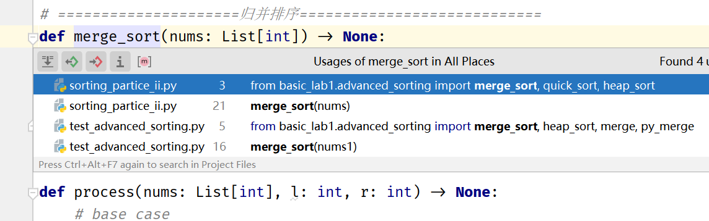
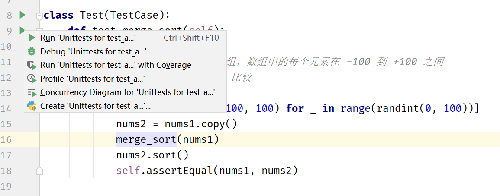
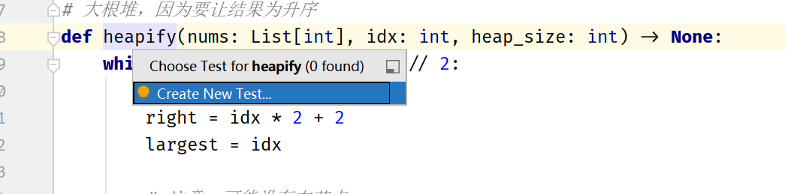
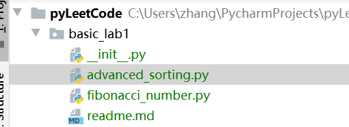

# 【算法笔面试真题精讲】第一次作业

## 第二章

- [2.4](arrange_boys_and_girls.py)
- [2.5](card_game.py)
- [2.6](assign_task_to_robot.py)
- [2.7](painter_xiaoq.py)

## 关于测试

前缀为 test 的文件都是测试，如 advanced_sorting.py 的测试文件是 test_advanced_sorting.py

###如何跳转到相应的测试

将输入光标放到函数名上，按 `Ctrl-B`，可以看到该函数所有的调用位置。选择以 test 为前缀的文件

###如何运行测试

直接点击绿色的播放按钮就行了。  
(也许可以使用 pytest 的之类的命令行工具，不过我现在脱坑命令行了。。。)

###如何创建测试

将输入光标放到函数名上，按 `Ctrl-Shift-T`

###运行测试之前

需要将目录结构弄成这样，不然导入可能会出问题

Pycharm 单元测试的官方文档: 
https://www.jetbrains.com/help/pycharm/testing-your-first-python-application.html#write-test  

## 致谢

助教幸苦了惹 (´▽`ʃ♡ƪ) 比心